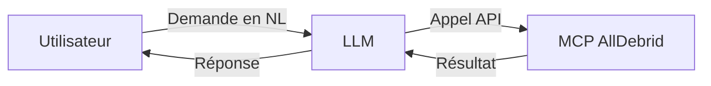

# 🌐 MCP AllDebrid
**[](LICENSE) [](https://www.python.org/downloads/)**

Un **Micro Command Processor (MCP)** pour interagir avec l’API **AllDebrid**, conçu pour être utilisé par un **LLM** (comme Le Chat).
L’utilisateur peut simplement demander en langage naturel (ex: *« Donne-moi les infos de mon compte AllDebrid »*), et le MCP s’occupe de tout en arrière-plan.

---

## 📋 Description
`mcp_alldebrid` est un serveur **FastAPI** qui permet à un LLM d’automatiser :
- La récupération d’informations utilisateur AllDebrid.
- Le débridage de liens.
- La gestion des téléchargements.

**Aucun code à écrire** : le LLM appelle le MCP en transparence.

---

## ✨ Fonctionnalités
| Fonctionnalité               | Description                                                                 |
|------------------------------|-----------------------------------------------------------------------------|
| **Gestion des utilisateurs** | Récupérer les informations du compte (quota, historique, etc.).           |
| **Débridage de liens**       | Générer des liens de téléchargement directs depuis des liens cryptés.      |
| **Téléchargements**          | Lancer et suivre des téléchargements depuis des magnets ou liens torents.  |
| **Automatisation**           | Planifier des tâches (ex: débridage automatique de liens).                 |
| **Intégration LLM**          | Conçu pour être appelé par un assistant via des requêtes naturelles.        |

---

## 🤖 Utilisation avec un LLM
L’utilisateur interagit **uniquement en langage naturel** :
> *« Donne-moi les infos de mon compte AllDebrid »*
> *« Débride ce lien : https://exemple.com/file.crypted »*

### Comment ça marche ?
1. Le LLM **interprète la demande** et appelle le MCP en arrière-plan.
2. Le MCP **exécute la tâche** (via l’API AllDebrid) et renvoie le résultat au LLM.
3. Le LLM **affiche la réponse** à l’utilisateur.



---

## 🔧 Configuration (pour les admins)
### 1. Déployer le MCP
```bash
git clone https://github.com/powershelling/mcp_alldebrid.git
cd mcp_alldebrid
pip install -e .
```

### 2. Configurer la clé API
Crée un fichier `.env` :
```env
ALLDEBRID_API_KEY=ta_clé_api  # Remplace par ta clé AllDebrid
```

### 3. Lancer le serveur MCP
```bash
uvicorn server:app --reload
```
- Le MCP sera accessible sur `http://localhost:8000`.
- **Pour un LLM** : Configurer cette URL comme endpoint d’outils externes.

---

## 📌 Notes techniques
- **Pas besoin d’importer manuellement** : Le LLM gère tout via des appels HTTP au MCP.
- **Sécurité** : La clé API est stockée côté serveur (jamais exposée à l’utilisateur).
- **Exemple de flux** :
  ```
  Utilisateur → LLM → MCP (appel API AllDebrid) → LLM → Utilisateur
  ```

---

## 📂 Structure du Projet
```
mcp_alldebrid/
├── server.py       # Serveur FastAPI (point d’entrée du MCP)
├── pyproject.toml  # Configuration Python
├── README.md       # Documentation
└── LICENSE         # Licence MIT
```

---

## 📄 Licence
Ce projet est sous licence **MIT** – libre à l’usage, modification et distribution.
*(Voir [LICENSE](LICENSE) pour plus de détails.)*

---

## 🤝 Contribution
Les **pull requests** sont les bienvenues !
Pour signaler un bug ou proposer une feature, ouvre une **[issue](https://github.com/powershelling/mcp_alldebrid/issues)**.